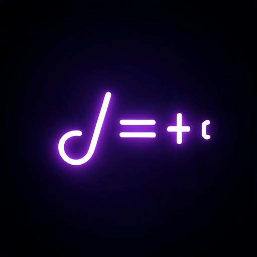
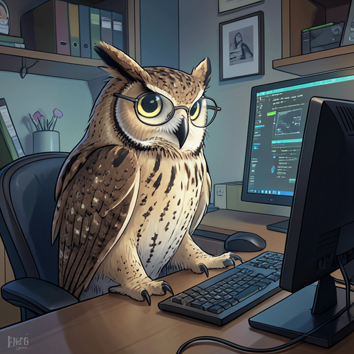
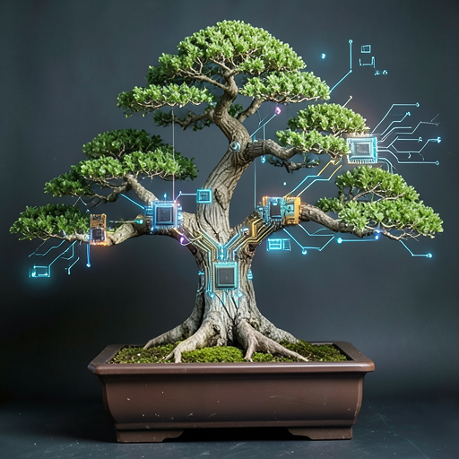
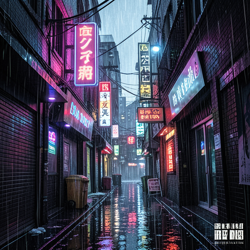
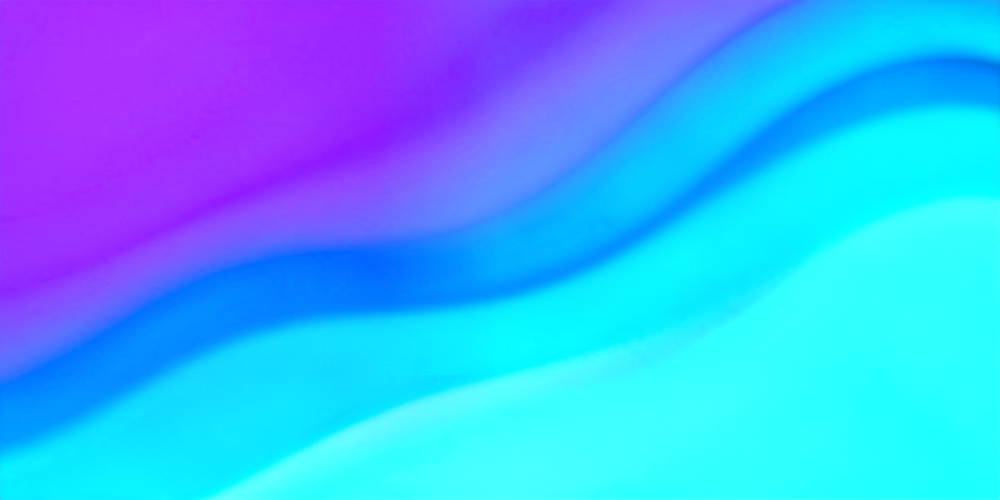

# Generated Images

100 images generated by guile-sage via `ollama-generate-image` using
the [x/flux2-klein:4b](https://ollama.com/x/flux2-klein) model on local Ollama.

## Pipeline

```
scripts/generate-showcase.scm   # Generate 100 images -> tests/fixtures/showcase/
scripts/promote-images.sh       # Promote to images/ with this README
```

Makefile targets:
```bash
make generate-showcase   # Run generation (requires Ollama + flux model)
make promote-images      # Copy showcase -> images/ and rebuild this README
```

**Total**: 100 images (100 present), 42 MB

## Scheme / Programming

| # | Image | Size | Prompt |
|---|-------|------|--------|
| 1 | [lambda-neon.png](lambda-neon.png) (512x512) | 195KB | lambda calculus symbol glowing in neon purple on dark background |
| 2 | [ast-visualization.png](ast-visualization.png) (512x512) | 254KB | abstract syntax tree visualization, colorful nodes and edges on dark background |
| 3 | [parens-fractal.png](parens-fractal.png) (512x512) | 272KB | parentheses nested in fractal pattern, lisp-inspired art |
| 4 | [terminal-green.png](terminal-green.png) (512x512) | 118KB | terminal screen with green text on black, hacker aesthetic |
| 5 | [recursive-fibonacci.png](recursive-fibonacci.png) (512x512) | 214KB | recursive function visualization, fibonacci spiral made of code |
| 6 | [binary-tree.png](binary-tree.png) (512x512) | 154KB | binary tree data structure, minimalist line art on white |
| 7 | [git-branches.png](git-branches.png) (512x512) | 227KB | git branch diagram, colorful branches merging, technical illustration |
| 8 | [call-stack.png](call-stack.png) (512x512) | 335KB | stack of colorful function calls, debug visualization |
| 9 | [scheme-repl.png](scheme-repl.png) (512x512) | 405KB | scheme repl prompt with s-expressions, retro computer aesthetic |
| 10 | [neural-network.png](neural-network.png) (512x512) | 378KB | neural network layers visualization, glowing interconnected nodes |

## AI / Agent

| # | Image | Size | Prompt |
|---|-------|------|--------|
| 11 | [robot-library.png](robot-library.png) (512x512) | 402KB | robot reading a book in a library, warm lighting |
| 12 | [circuit-brain.png](circuit-brain.png) (512x512) | 406KB | artificial brain made of glowing circuits, blue and white |
| 13 | [sage-owl.png](sage-owl.png) (512x512) | 424KB | owl wearing glasses sitting at a computer, digital art |
| 14 | [agent-network.png](agent-network.png) (512x512) | 230KB | constellation of interconnected AI agents, network diagram style |
| 15 | [human-robot-handshake.png](human-robot-handshake.png) (512x512) | 349KB | human and robot shaking hands, partnership concept |
| 16 | [chat-flow.png](chat-flow.png) (512x512) | 201KB | chat bubbles flowing between two entities, conversation visualization |
| 17 | [code-review.png](code-review.png) (512x512) | 222KB | magnifying glass over source code, code review concept |
| 18 | [agent-toolbox.png](agent-toolbox.png) (512x512) | 373KB | toolbox with wrenches and gears, tool-use concept art |
| 19 | [decision-tree.png](decision-tree.png) (512x512) | 157KB | thought bubble with branching decision tree inside |
| 20 | [code-compass.png](code-compass.png) (512x512) | 208KB | compass rose with code symbols at cardinal points, navigation concept |

## Architecture / Infrastructure

| # | Image | Size | Prompt |
|---|-------|------|--------|
| 21 | [server-rack.png](server-rack.png) (512x512) | 396KB | server rack with glowing blue LEDs in dark data center |
| 22 | [message-queue.png](message-queue.png) (512x512) | 239KB | message queue pipeline, flowing data packets illustration |
| 23 | [microservices.png](microservices.png) (512x512) | 239KB | microservices architecture diagram, colorful hexagons connected |
| 24 | [docker-ship.png](docker-ship.png) (512x512) | 430KB | container ship made of docker containers, digital art |
| 25 | [network-lighthouse.png](network-lighthouse.png) (512x512) | 516KB | lighthouse beacon sending signals across network, cyberpunk style |
| 26 | [bridge-infra.png](bridge-infra.png) (512x512) | 387KB | bridge connecting two islands, infrastructure metaphor, sunset |
| 27 | [honeycomb-services.png](honeycomb-services.png) (512x512) | 364KB | honeycomb pattern of interconnected services, technical illustration |
| 28 | [watchtower-security.png](watchtower-security.png) (512x512) | 517KB | watchtower overlooking a digital landscape, security monitoring concept |
| 29 | [cicd-pipeline.png](cicd-pipeline.png) (512x512) | 507KB | pipeline flowing through stages, CI/CD concept art |
| 30 | [distributed-map.png](distributed-map.png) (512x512) | 321KB | map with glowing connection lines between cities, distributed systems |

## Nature / Organic

| # | Image | Size | Prompt |
|---|-------|------|--------|
| 31 | [circuit-bonsai.png](circuit-bonsai.png) (512x512) | 418KB | bonsai tree with circuit board branches, tech-nature fusion |
| 32 | [mycelium-network.png](mycelium-network.png) (512x512) | 538KB | mycelium network underground, glowing connections, cross-section view |
| 33 | [data-dandelion.png](data-dandelion.png) (512x512) | 376KB | dandelion seeds dispersing in wind, each seed is a data packet |
| 34 | [coral-reef.png](coral-reef.png) (512x512) | 477KB | coral reef ecosystem, vibrant colors, biodiversity |
| 35 | [aurora-lake.png](aurora-lake.png) (512x512) | 339KB | aurora borealis over mountain lake, reflection |
| 36 | [bee-pollination.png](bee-pollination.png) (512x512) | 354KB | bee pollinating flower, macro photography, golden hour |
| 37 | [crystal-cave.png](crystal-cave.png) (512x512) | 470KB | crystal cave with glowing minerals, underground wonder |
| 38 | [tree-rings.png](tree-rings.png) (512x512) | 506KB | tree rings cross section showing growth patterns, macro |
| 39 | [murmuration.png](murmuration.png) (512x512) | 457KB | flock of starlings forming murmuration pattern in sunset sky |
| 40 | [nautilus-golden.png](nautilus-golden.png) (512x512) | 415KB | nautilus shell spiral, golden ratio, mathematical beauty |

## Abstract / Geometric

| # | Image | Size | Prompt |
|---|-------|------|--------|
| 41 | [voronoi-gradient.png](voronoi-gradient.png) (512x512) | 307KB | voronoi diagram in gradient colors, computational geometry |
| 42 | [penrose-tiling.png](penrose-tiling.png) (512x512) | 527KB | penrose tiling pattern, impossible geometry, colorful |
| 43 | [mobius-data.png](mobius-data.png) (512x512) | 507KB | mobius strip made of flowing data, infinite loop concept |
| 44 | [escher-tessellation.png](escher-tessellation.png) (512x512) | 635KB | tessellation pattern inspired by MC Escher, morphing shapes |
| 45 | [sacred-geometry.png](sacred-geometry.png) (512x512) | 468KB | sacred geometry mandala, intricate symmetric pattern |
| 46 | [wave-interference.png](wave-interference.png) (512x512) | 380KB | wave interference pattern, double slit experiment visualization |
| 47 | [impossible-triangle.png](impossible-triangle.png) (512x512) | 287KB | impossible triangle made of glass, optical illusion |
| 48 | [topographic-map.png](topographic-map.png) (512x512) | 554KB | topographic contour map, elevation lines in earth tones |
| 49 | [op-art-3d.png](op-art-3d.png) (512x512) | 482KB | op art black and white pattern creating 3D illusion |
| 50 | [kaleidoscope.png](kaleidoscope.png) (512x512) | 666KB | kaleidoscope pattern with jewel tones, symmetric radial design |

## Retro / Vintage

| # | Image | Size | Prompt |
|---|-------|------|--------|
| 51 | [retro-computer-80s.png](retro-computer-80s.png) (512x512) | 429KB | vintage computer with CRT monitor, 1980s office |
| 52 | [punch-cards.png](punch-cards.png) (512x512) | 416KB | punch card stack, early computing, sepia tone photograph |
| 53 | [vacuum-tubes.png](vacuum-tubes.png) (512x512) | 409KB | vacuum tubes glowing orange, old radio electronics |
| 54 | [blueprint-schematic.png](blueprint-schematic.png) (512x512) | 230KB | blueprint technical drawing, engineering schematic, blue and white |
| 55 | [art-deco-poster.png](art-deco-poster.png) (512x512) | 382KB | art deco poster design, geometric patterns, gold and black |
| 56 | [typewriter-closeup.png](typewriter-closeup.png) (512x512) | 343KB | old typewriter with paper, close-up of typebars |
| 57 | [analog-synth.png](analog-synth.png) (512x512) | 530KB | analog synthesizer with patch cables, modular synth |
| 58 | [cassette-art.png](cassette-art.png) (512x512) | 310KB | cassette tape with magnetic ribbon unwound artistically |
| 59 | [vintage-map.png](vintage-map.png) (512x512) | 592KB | vintage map with compass rose and sea monsters |
| 60 | [clock-mechanism.png](clock-mechanism.png) (512x512) | 422KB | old clock mechanism, gears and springs, macro photography |

## Minimalist / Icon

| # | Image | Size | Prompt |
|---|-------|------|--------|
| 61 | [lightbulb-idea.png](lightbulb-idea.png) (512x512) | 227KB | single light bulb glowing warmly on dark background, minimal |
| 62 | [paper-airplane.png](paper-airplane.png) (512x512) | 71KB | paper airplane flying upward, trailing dotted line, white background |
| 63 | [key-lock.png](key-lock.png) (512x512) | 120KB | key and lock, simple elegant illustration, security concept |
| 64 | [hourglass-time.png](hourglass-time.png) (512x512) | 132KB | hourglass with sand flowing, time concept, minimal style |
| 65 | [seedling-growth.png](seedling-growth.png) (512x512) | 276KB | seedling growing from soil, growth concept, clean background |
| 66 | [puzzle-pieces.png](puzzle-pieces.png) (512x512) | 383KB | puzzle pieces fitting together, collaboration concept |
| 67 | [open-book.png](open-book.png) (512x512) | 314KB | open book with pages turning, knowledge concept |
| 68 | [anchor-stability.png](anchor-stability.png) (512x512) | 139KB | anchor symbol, stability concept, nautical minimal art |
| 69 | [summit-flag.png](summit-flag.png) (512x512) | 151KB | mountain peak with flag, achievement concept, simple illustration |
| 70 | [origami-crane.png](origami-crane.png) (512x512) | 225KB | origami crane, elegant paper fold, minimal white background |

## Sci-fi / Futuristic

| # | Image | Size | Prompt |
|---|-------|------|--------|
| 71 | [holo-display.png](holo-display.png) (512x512) | 417KB | holographic display floating in mid-air, futuristic interface |
| 72 | [space-elevator.png](space-elevator.png) (512x512) | 328KB | space elevator reaching into orbit, earth below |
| 73 | [dyson-sphere.png](dyson-sphere.png) (512x512) | 492KB | dyson sphere around a star, mega-structure concept art |
| 74 | [terraformed-mars.png](terraformed-mars.png) (512x512) | 508KB | terraformed mars with oceans and green continents |
| 75 | [quantum-computer.png](quantum-computer.png) (512x512) | 465KB | quantum computer core, glowing qubits in cryogenic chamber |
| 76 | [warp-drive.png](warp-drive.png) (512x512) | 499KB | warp drive engine room, blue plasma glow, starship interior |
| 77 | [solarpunk-city.png](solarpunk-city.png) (512x512) | 403KB | floating city in clouds, solarpunk architecture |
| 78 | [alien-monolith.png](alien-monolith.png) (512x512) | 407KB | alien monolith on barren planet, mysterious artifact |
| 79 | [cyberpunk-alley.png](cyberpunk-alley.png) (512x512) | 541KB | cyberpunk alley with neon signs and rain reflections |
| 80 | [ringworld.png](ringworld.png) (512x512) | 469KB | ringworld space habitat, interior view with landscape curving upward |

## Art Styles

| # | Image | Size | Prompt |
|---|-------|------|--------|
| 81 | [impressionist-garden.png](impressionist-garden.png) (512x512) | 577KB | impressionist painting of a garden path with flowers, monet style |
| 82 | [cubist-portrait.png](cubist-portrait.png) (512x512) | 570KB | cubist portrait in earth tones, picasso inspired |
| 83 | [art-nouveau-floral.png](art-nouveau-floral.png) (512x512) | 428KB | art nouveau floral border design, mucha style |
| 84 | [pointillist-sea.png](pointillist-sea.png) (512x512) | 692KB | pointillist seascape, dots of color forming waves and sky |
| 85 | [pop-art-comic.png](pop-art-comic.png) (512x512) | 500KB | pop art comic panel, bold colors, halftone dots |
| 86 | [ink-wash-mountains.png](ink-wash-mountains.png) (512x512) | 401KB | chinese ink wash painting of misty mountains, traditional |
| 87 | [stained-glass.png](stained-glass.png) (512x512) | 488KB | stained glass window design, gothic cathedral, vibrant colors |
| 88 | [aboriginal-dots.png](aboriginal-dots.png) (512x512) | 618KB | aboriginal dot painting, dreamtime story, earth tones |
| 89 | [ukiyoe-fuji.png](ukiyoe-fuji.png) (512x512) | 601KB | ukiyo-e style cherry blossoms and mount fuji |
| 90 | [persian-miniature.png](persian-miniature.png) (512x512) | 652KB | persian miniature painting, garden scene with birds |

## Hero / Banner (1024x512)

| # | Image | Size | Prompt |
|---|-------|------|--------|
| 91 | [hero-golden-tree.png](hero-golden-tree.png) (1024x512) | 837KB | wide landscape of rolling hills with a single tree, golden hour, cinematic |
| 92 | [hero-future-city.png](hero-future-city.png) (1024x512) | 881KB | panoramic view of a futuristic city skyline at dusk |
| 93 | [hero-gradient-wave.png](hero-gradient-wave.png) (1024x512) | 414KB | abstract flowing gradient, purple to blue to cyan, smooth waves |
| 94 | [hero-community.png](hero-community.png) (1024x512) | 841KB | open source community, diverse people collaborating around a table with laptops |
| 95 | [hero-babel-library.png](hero-babel-library.png) (1024x512) | 982KB | library of babel, infinite bookshelves stretching into distance |
| 96 | [hero-forge.png](hero-forge.png) (1024x512) | 822KB | forge with molten metal and sparks, craftsmanship concept |
| 97 | [hero-ocean-sunrise.png](hero-ocean-sunrise.png) (1024x512) | 784KB | ocean waves at sunrise, long exposure photography |
| 98 | [hero-starfield.png](hero-starfield.png) (1024x512) | 1146KB | starfield with nebula, wide format space panorama |
| 99 | [hero-zen-stones.png](hero-zen-stones.png) (1024x512) | 669KB | zen stones stacked on beach at sunset, balance and harmony |
| 100 | [hero-wisdom-tree.png](hero-wisdom-tree.png) (1024x512) | 878KB | ancient tree with massive roots, wisdom and knowledge concept, magical lighting |

## Thumbnails (sample)

| | | | | |
|---|---|---|---|---|
|  |  |  |  |  |
